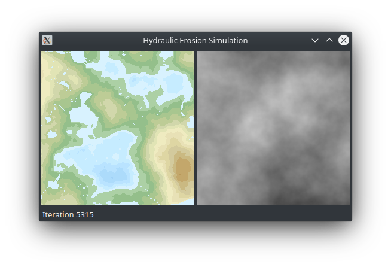

# Erosion Sim
Procedural terrain generator via hydraulic erosion simulation.

The initial terrain is generated via 2D Perlin noise. Then, water is added through random precipitation by taking 2D slices from 3D Perlin noise. Water flow along with force-based and dissolution-based erosion are then simulated to produce natural looking terrain.



The resulting terrain (left) after 5315 generations and the current precipitation (right). Results will vary depending on seed, precipitation amount, and erosion constants.

## Compiling and running

Qt5 needs to be installed.

```
qmake
make
./erosion-sim
```
